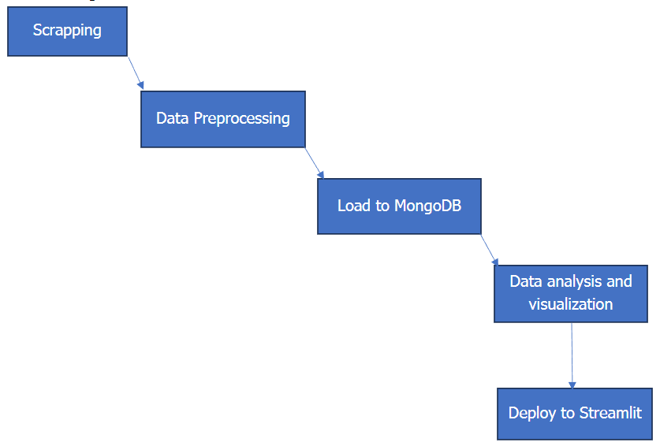

# 🕸️ Scrapping-Project
This project is a comprehensive web scraping and data analysis pipeline focused on extracting, processing, and visualizing hotel data. It encompasses data collection, cleaning, storage, and interactive visualization components.

### 🚀 Get Started
Ensure that you have required libraries:
```
pip install requests beautifulsoup4 pandas numpy matplotlib seaborn streamlit pymongo
git clone https://github.com/yahia997/Scrapping-Project.git
cd Scrapping-Project/Streamlit
streamlit run web.py
```

### ➡️ Pipeline 
We followed ETL pipeline as developers do in real world projects. So that we make 
Load MongoDB first then we extract from it using MQL queries and make 
visualizations and analytics on it. If data is Loaded at the final stage then the data is 
for achieving.


#### 🕷️ Data Extraction (Scrapping) [Yahya Mahmoud] 
I used selenium with beautifulSoup to scrap the website. Selenium to be able to 
interact with the page such as click on buttons and to imitate user behavior to as a 
bot to get the “price” Field (can not be extracted with bs4).

We will get data about hotels in Egypt in the following cities: 
- Alexandria 
- Cairo 
- Hurghada 
- Sharm El Sheikh 
- Ain Sokhna 
- Dahab 
- Port Said 
- North Coast 
- Fayoum 
- Aswan 
- Marsa Alam 
- Ismailia

Example of objects we get:
```json
{
    "title": "Serry Beach Resort",
    "url": "https://www.booking.com/hotel/eg/serry-beach-resort.html?label=gen173nr-1FCAEoggI46AdIM1gEaEOIAQGYATG4ARfIAQzYAQHoAQH4AQKIAgGoAgO4AuHX6b8GwAIB0gIkNWQ1YjkzZWYtMmFmMy00ZjNmLWJhYTItNzE5ZjdkMmNkNDQy2AIF4AIB&aid=304142&ucfs=1&arphpl=1&checkin=2025-04-12&checkout=2025-04-13&dest_id=-290029&dest_type=city&group_adults=2&req_adults=2&no_rooms=1&group_children=0&req_children=0&hpos=2&hapos=2&sr_order=popularity&srpvid=f10c684cab0f06df&srepoch=1744469395&all_sr_blocks=1006733303_375845967_2_1_0&highlighted_blocks=1006733303_375845967_2_1_0&matching_block_id=1006733303_375845967_2_1_0&sr_pri_blocks=1006733303_375845967_2_1_0__38500&from_sustainable_property_sr=1&from=searchresults",
    "price": "EGP 1,294",
    "address": "27.187356614148406,33.83184586779785",
    "description": "Well located in Hurghada, Serry Beach Resort provides air-conditioned rooms, an outdoor swimming pool, free WiFi and a fitness center. With a private beach area, the property also features a terrace, as well as a bar. The property has a kids' club, room service and currency exchange for guests.\n\nAt the hotel, each room is equipped with a closet. Each room has an electric tea pot and a private bathroom with a shower and free toiletries, while selected rooms come with a kitchenette equipped with a microwave. Guest rooms at Serry Beach Resort are equipped with a flat-screen TV with satellite channels and a safety deposit box.\n\nThe breakfast offers buffet, continental or Full English/Irish options. At the accommodation you'll find a restaurant serving African, Middle Eastern and Seafood cuisine. Vegetarian, halal and gluten-free options can also be requested.\n\nSerry Beach Resort has a playground. You can play pool, table tennis, and darts at the 5-star hotel.\n\nSpeaking Arabic, German, English and French, staff at the reception can help you plan your stay.\n\nPopular points of interest near the hotel include Albatros White Beach, Marina Sports Club Beach and Old Vic Beach. Hurghada International Airport is 1.2 miles away, and the property offers a paid airport shuttle service.",
    "address2": "3, Touristic Villages, Hurghada 3, Touristic Villages, Hurghada, 84511 Hurghada, EgyptExcellent location – rated 9.3/10!(score from 304 reviews)Real guests • Real stays • Real opinions",
    "facilities": [
      "Outdoor swimming pool",
      "Free Wifi",
      "Airport shuttle",
      "Beachfront",
      "Family rooms",
      "Spa",
      "Fitness center",
      "Bar",
      "Private beach area",
      "Good Breakfast",
      "Outdoor swimming pool",
      "Free Wifi",
      "Airport shuttle",
      "Beachfront",
      "Family rooms",
      "Spa",
      "Fitness center",
      "Bar",
      "Private beach area",
      "Good Breakfast"
    ],
    "reviews_cnt": "304 reviews",
    "rating": "Scored 8.8 ",
    "rating_details": {
      "Staff ": "8.8",
      "Facilities ": "9.0",
      "Cleanliness ": "9.2",
      "Comfort ": "9.2",
      "Value for money ": "8.3",
      "Location ": "9.3",
      "Free Wifi ": "9.4"
    },
    "comments": [
      {
        "name": "Deni United States“We had a lovely stay at Serry Beach Resort. The property is beautiful, with a stunning pool and beach that made for the perfect relaxation spot. The atmosphere was peaceful, and the staff were friendly and welcoming. We truly enjoyed our time here...”Read more",
        "country": " United States",
        "description": " United States"
      },
      {
        "name": "Pinky-traveladdict Norway“The service was top, and everyone was happy and friendly.\nFatima at the reception went out of her to see that we get the best room.\nThere was a variety of food dishes, so many options to choose. The best part was late breakfast and lunch for those...”Read more",
        "country": " Norway",
        "description": " Norway"
      },
      {
        "name": "Kevwe France“I loved how clean this property was, the great food, the accommodating staff, the entertainment timetable, the large single beds that could comfortably fit in two people, the clean beach, the view from my room… I could go on and on”Read more",
        "country": " France",
        "description": " France"
      },
      {
        "name": "Chuxuan China“Amazing location at the beach with beautiful long pool and sun chairs. Breakfast offers large variety and is tasty.”Read more",
        "country": " China",
        "description": " China"
      },
      {
        "name": "Abdulrahman Turkey“One of the best resorts in Hurghada recommend it to everyone going there”Read more",
        "country": " Turkey",
        "description": " Turkey"
      },
      {
        "name": "Qudsiyah United Kingdom“It was clean, beautiful, scenic, peaceful, aesthetic, vibes were immaculate and just amazing everywhere you looked.”Read more",
        "country": " United Kingdom",
        "description": " United Kingdom"
      },
      {
        "name": "Yaro United Kingdom“We got upgraded to a room that was beach front and it was an amazing stay for us. Food was phenomenal”Read more",
        "country": " United Kingdom",
        "description": " United Kingdom"
      },
      {
        "name": "Hassan Saudi Arabia“As my first experience in an all inclusive hotel I found the stay wonderful by all measures. The facilities were second to none especially in Egypt, the room was great, the food is incredible with huge variety. However what tops it all off and the...”Read more",
        "country": " Saudi Arabia",
        "description": " Saudi Arabia"
      },
      {
        "name": "Mohammed Qatar“Serry beach resort is an exceptional resort with beautiful surroundings and top-notch amenities. The highlight of my visit was the outstanding service from our butler, Waleed and mohammed , who went above and beyond to ensure a perfect stay with...”Read more",
        "country": " Qatar",
        "description": " Qatar"
      },
      {
        "name": "Menghan China“Amazing facility. Buffet 100%. Recommend to get the all inclusive. Special shoutout to Fatima at front desk and Yasser from food & beverage for professional and patient assistance”Read more",
        "country": " China",
        "description": " China"
      }
    ]
  }
```

#### 🔧 Data Cleaning, preprocessing and Regular expressions 
As our data in JSON format we will loop through each hotel and 
preprocess it rather than using pandas dataframe. We have nested object 
that we can not store and process in pandas such as comments list. 
We will not use Spark RDDs as it is well suited for big data. 
 
From the scrapped data we did the following to preprocess it and make it 
read to deploy: 
- "address": 
separated longitude and latitude with regex. We have comma 
between them and set their data type to float. 
 
- “address2”: 
We make a list from cities we want to scape and check if this city 
belongs to this address or not as the “address2” does not have 
fixed schema. 
 
We make country always equal to Egypt. 
 
We removed all the unwanted text with regex after the country 
such as “EgyptExcellent location – rated 9.3/10!(score 
from 304 reviews)Real guests • Real stays • Real 
opinions” this pattern is repeated in a lot of objects. 
 
- "reviews_cnt": 
We get the number of reviews and removed “reviews” keyword 
and comma from it with regrex and converted it to int datatype. 
- "rating": 
We did the same thing as we did in “reviews_cnt” 
- "comments": 
We noticed the following pattern: 
“<name> <country>”<description>”Read more” and all that is 
merged in name attribute. 
Ex: 
"Deni United States“We had a lovely stay at Serry 
Beach Resort. The property is beautiful, with a 
stunning pool and beach that made for the perfect 
relaxation spot. The atmosphere was peaceful, and the 
staff were friendly and welcoming. We truly enjoyed 
our time here...”Read more" 
1-  We split by comma so we git “<name> <country>” and 
”<description>” and “Read more” 
2-  Then we get name and country by splitting the first part by 
space and. 
3-  The second part is the description. 
 
- "facilities": 
We removed duplicates by putting it in a set and cast it to list 
again. 
- "description": 
Removed extra <h2></h2> with regrex. 
- Remove duplicates from all data. 
We checked that url is fetched before or not. 
- Handle missing data at all. 
We filled missing Price with “Unknown”. Rating and rating_details 
with None. 
- Handle extra white spaces. 
We strip fields such as description, country. 

#### 🍃 Load to MongoDB Atlas 
We deployed before analysis to make any person capture data from any 
where and make his analysis (As in real projects). 
We make that also to benefit from MongoDB Aggregation pipeline which 
will enable us make analysis more easily and faster (we will use python 
libraries If needed).

In Code I used Pymongo to load the preprocessed data with python to 
MongoDB atlas. 
I also put 'revision' filed to each object to mention the schema version 
(That is a design pattern in MongoDB that is suitable for data analysis to 
access data based on the schema version).

#### 📊 Data analysis and visualization
You can see it in 'visualization.ipynb' or you can write in terminal:
```
git clone https://github.com/yahia997/Scrapping-Project.git
cd Scrapping-Project/Streamlit
streamlit run web.py
```